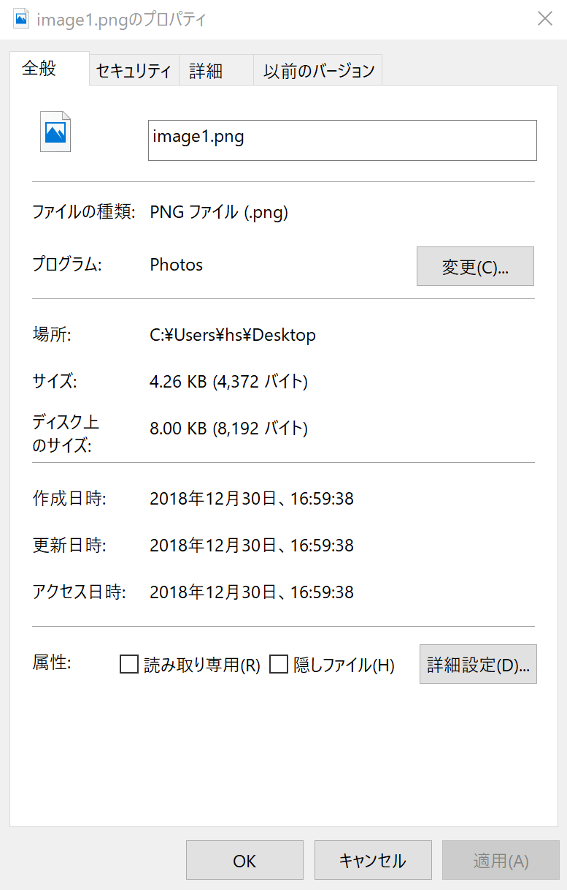

# [第5回：▼ 画像の保存・アニメーション](@id ch05)

## プロットデフォルトの設定5

この節では，既定に近いプロット・デフォルトを設定する．

```@example ch005
using LinearAlgebra

aux = (label="", lc=:black, lw=0.5)
using Plots
using Plots.PlotMeasures

Plots.reset_defaults()
default(
    warn_on_unsupported=true)
```

## ■ テキストを表示する

プロット・オブジェクトに，テキストを追加するには，
関数 `annotate!(x,y,text)` を用いる． 

```@example ch005
scatter([0,0.5,1],[0,0.5,1], shape=:circle, ms=36)
annotate!(0.5,0.5,"abc")
```

既定では，テキストの中心が座標 `(x,y)` にくるように配置される．

フォント寸法や色を変える場合は，`text(文字列, オプション)`を用いる．

- `pointsize=` 文字サイズ
- `halign=` 水平方向位置 `:hcenter`, `:left` , `:right` のいずれか
- `valign=` 垂直方向位置 `:vcenter`, `:top` , `:bottom` のいずれか
- `color=色` テキストの色

```@example ch005
# 続けて
annotate!(0.25,0.25,
    text("red",pointsize=16, color=:red))
annotate!(0.5,0.75,
    text("left, top",
        pointsize=12, halign=:left, valign=:top, color=:blue))
# 上のコードは，次のように書いてもよい
# annotate!(0.25,0.75, 
#   text("left, top", 12, :left, :top, :blue))
```


## ■ 漢字テキストを表示する

「IPAゴシック」フォントがインストールされている必要がある．

- 文字情報技術促進協議会 [IPAexフォントおよびIPAフォントについて](https://moji.or.jp/ipafont/)

```julia
ENV["GKS_ENCODING"] = "utf8"
using Plots
gr(fontfamily = "IPAGothic") # <=
plot()
annotate!(0.5,0.5,"こんにちわ")
```


## ■ プロット・オブジェクト

関数 `plot` と `plot!` はプロット・オブジェクトを作る．
複数のプロットを作成する場合には，プロット・オブジェクトを陽に扱う必要がある．


```@example ch005
ts = 0:pi/18:2pi
xs = cos.(ts)
ys = sin.(ts)
# 新しいプロットの作成
plot(xs,ys)
# 既存のプロットに上書き
plot!(2xs,2ys)
```

上のコードの最後の2行を，
プロットオブジェクトを陽に出して記述すると以下のようになる．

```@example ch005
# 新しいプロットオブジェクト p1 を作る
p1 = plot(xs,ys)
# p1に上書き
plot!(p1, 2xs,2ys)
nothing #hide
```

(図面は同じなので省略)

関数 `plot!(p,)` のように，プロット・オブジェクト `p` を第1引数に記載すると，
`p` に対してプロット・オブジェクトが修正される．
プロットオブジェクトを変更する関数 
`xlims!`，`ylims!`，`xlabel!`，`ylabels!` などの
第1引数にもプロットオブジェクトを指定できる．

```@example ch005
# 続けて
plot!(aspect_ratio=:equal)
xlims!(p1,-4,4)
ylims!(p1,-4,4)
```

## ▼ 複数のプロットを行列として配置する

複数のプロット（サブプロット）・オブジェクトを縦横に配置して，
一つのプロットにまとめることができる．

```@example ch005
using Plots
using Plots.PlotMeasures
closeall() #hide
ts = 0:pi/18:2pi
xs = cos.(ts)
ys = sin.(ts)

p1 = plot(xs, ys)
p2 = plot(xs.+1,ys.+1)
nothing #hide
```

関数 `plot` の直後に，複数のサブプロット・オブジェクトを指定し，
さらに，キーワード引数 `layout=(nx,ny)` と併用しよう．
複数のサブプロットが `nx` x `ny` の行列の形に並ぶ．

```@example ch005
# 2行
plot(p1,p1, layout=(2,1))
```

```@example ch005
# 2列
plot(p1,p1, layout=(1,2))
```

```@example ch005
# 2行 2列
plot(p1,p2,p1,p1, layout=(2,2))
```

p2 が，どこに配置されたか観察せよ．


## ▼ 上下のサブプロットで横軸を共通にする

上記2行の配置の例で，上下の横軸は独立である．

```@example ch005
# 続けて
# 2行
plot(p1,p2, layout=(2,1))
```

上下のサブプロットの縦軸を共通にするには，
キーワードパラメータ `link=:x` を用いる．

```@example ch005
# 続けて
# 2行．横軸を共通とする
p3=plot(p1,p2, layout=(2,1), link=:x)  # <=
# 共通の横軸の描画範囲を変更する
xlims!(p3,-4,4)
```

上下のサブプロットを近づけるには，
`bottom_margin=` で，サブプロット下側の余白を詰める．

さらに，下サブプロットの凡例を，
上サブプロットの凡例に含めた．

```@example ch005
# 続けて
p1a=plot(xs, ys, xaxis=:false, # <= x軸を表示させない
    lc=1,label="circle1")
# 下サブプロットに凡例はつけない
p2a=plot(xs.+1,ys.+1,lc=2,label="")
plot!(p2a, xlims=(-4,4), ylims=(-4,4))
# 上サブプロットに表示されない位置にデータを追加し，
# 下サブプロットに表示すべき凡例を指定する
plot!(p1a, [-1],[-1], lc=2, label="circle2")
plot!(p1a, xlims=(-4,4), ylims=(-4,4))
p3a=plot(p1a,p2a, link=:x,
   layout=(2,1), 
   bottom_margin=[-20px 0px])  # <= 要調整
```


## ▼ 左右のサブプロットで縦軸を共通にする

同様に，
2列の配置の例 `layout=(1,2)` で，
キーワードパラメータ `link=:y` を用いて，
独立であった左右の縦軸を共通にできる
（左軸を修正すると，右軸にも反映される）．

```@example ch005
# 続けて
p1b=plot(xs, ys, 
    lc=1,label="circle1")
plot!(p1b, [-1],[-1], lc=2, label="circle2")
# 2列．縦軸を共通とする
p4=plot(p1b,p2a, layout=(1,2), link=:y)
# 共通の横軸の描画範囲を変更する
ylims!(p4,-4,4)
```

左右のサブプロットを近づけるには，
`right_margin=` で，サブプロット右側の余白を詰める．

さらに，右サブプロットの凡例を，
左サブプロットの凡例に含めた．

```@example ch005
# 続けて
p1c=plot(xs, ys, 
    lc=1,label="circle1")
# 下サブプロットに凡例はつけない
p2b=plot(xs.+1,ys.+1,lc=2,
    yaxis=:false, # <= y軸を表示させない
    label="")
plot!(p2b, xlims=(-4,4), ylims=(-4,4))
# 上サブプロットに表示されない位置にデータを追加し，
# 下サブプロットに表示すべき凡例を指定する
plot!(p1c, [-1],[-1], lc=2, label="circle2")
plot!(p1c, xlims=(-4,4), ylims=(-4,4))
p3b=plot(p1c,p2b, link=:y,
   layout=(1,2), 
   right_margin=[-30px 0px])  # <= 要調整
```


## ▲ 鉛直上投げ自由落下運動を描く・上下2枚のサブプロット

前章の [▼ 鉛直上投げ自由落下運動を描く](@ref)では，
速度-時刻，高さ-時刻の二つのプロットを作成した．
今度は，横軸 時刻を共通にした上下2枚のサブプロットを作成せよ．

模範解答の例のみ示す．

さらに，初速度 `v0` を，色々変えて描け．

```@eval
using Plots
using Plots.PlotMeasures
closeall() #hide
aux = (label="", lc=:black, lw=0.5)
plot(framestyle=:axes, grid=false)
v0 = 10 # m/s
g = 9.8 # m/s^2

ts = 0:0.1:3 # s
vs = v0 .- g * ts
ys = v0 * ts .- g * ts .^ 2 / 2
p1 = plot!(ts, vs, lc=1,
    ylabel="v / m s^-1", xaxis=:false,
    label="velocity")
p2 = plot(ts, ys, lc=2,
    xlabel="time / s", ylabel="y / m",
    label="")
plot!(p1, [-10],[10], lc=2,label="height")
ylims!(p1,-20,10)
hline!(p1, [0]; aux...)
vline!(p1, [v0/g]; aux...)
vline!(p2, [v0/g]; aux...)
p3 = plot(p1,p2, link=:x,
   layout=grid(2,1), 
   bottom_margin=[-30px 0px])
xlims!(p3, 0, 3)
savefig("ball-plot-p3.svg")
nothing
```


## ▼ ダブルYプロットを描く

ダブルYプロットは，
$x$軸を共通として，左と右に，2つの $y$軸を配置するプロットである．

元のプロット・オブジェクトに，`twinx()` を追加する．
関数 `twinx()` は，直近に描かれたプロットオブジェクトに対して，横軸（``x`` 軸）が共通で，
右側に新しい縦軸（``x`` 軸）を持つ，新しいプロットオブジェクトを作る．

```@example ch005
using Plots
closeall() #hide
ts = 0:pi/18:2pi
xs = cos.(ts)
ys = sin.(ts)

plot(xs, ys)
p2=plot!(twinx(), xs.+1,ys.+1)
nothing #hide
```

プロット・オブジェクトを陽に表す場合は，関数 `twinx(p)` を用いる．プロット・オブジェクト `p` を元にすることを除き，
`twinx()` と同様である．

```@example ch005
p1=plot(xs, ys)
p2=plot!(twinx(), xs.+1,ys.+1)
```
（結果は同じ．図は省略）

横軸と左縦軸を調整する場合は `p1`を，
右縦軸を調整する場合は `p2` を対象とする．

```@example ch005
ylims!(p1, -1.5,2.5)  # left axis
ylims!(p2, -1.5,2.5)  # right axis
xlims!(p1,-2.5,2.5) # common x axis
plot!(p1, aspect_ratio=:equal)
p1
```

ここまで，`p1`, `p2` の両方に凡例が描画されてしまっている．
`p1` 側に，凡例を寄せる方法については，追って説明する．


## ▲ 鉛直上投げ自由落下運動を描く・ダブルYプロット

上の [▲ 鉛直上投げ自由落下運動を描く・上下2枚のサブプロット](@ref) では，上下2枚のサブプロットを作成した．
今度は，ダブルYプロットとして描け．

模範解答の例のみ示す．

さらに，初速度 `v0` を，色々変えて描け．
速度 0 において高さが最高になることを，うまく表示せよ．

```@eval
using Plots
closeall() #hide
aux = (label="", lc=:black, lw=0.5)
v0 = 10 # m/s
g = 9.8 # m/s^2

ts = 0:0.1:3 # s
vs = v0 .- g * ts
ys = v0 * ts .- g * ts .^ 2 / 2
p1 = plot(ts, vs, lc=1,
    ylabel="v / m s^-1", xlabel="time / s",
    label="velocity")
p2 = plot!(twinx(p1), ts, ys, lc=2,
    xlabel="", ylabel="y / m",
    label="")
hline!(p1,[0]; aux...)
vline!(p1,[v0/g]; aux...)
plot!(p1, [-10],[10], lc=2,label="height")
xlims!(p1,-0.2,3.2)
savefig("ball-plot-dy.svg")
nothing
```


## プロットデフォルトの設定11

```@example ch010
aux = (label="", lc=:black, lw=0.5)
using LaTeXStrings
using Plots
using Plots.PlotMeasures

Plots.reset_defaults()
default(
    size=(720,480),
    framestyle=:box,thickness_scaling=2,
    dpi=150,
    guidefontsize=10,
    tickfontsize=8,
    legendfontsize=8,
    aspect_ratio=:auto,
    label="",
    legend_foreground_color=nothing,
    legend_background_color=nothing,
    grid=false,xlabel="", ylabel="",
    palette=:Set1_9,
    linewidth=2,
    markershape=:none,
    markersize=2,
    markerstrokewidth=0,
    warn_on_unsupported=true)
```

## ▶ 画像と画像ファイル

ファイルシステムを簡単に説明した後，
画像ファイルを保存する方法を説明する．

### ▶ ファイル名・パス名・拡張子

Windows, MacOS, Linux など，多くの「オペレーティング・システム（OS; Operating System） 」では，
「フォルダ（folder）」あるいは「ディレクトリ（directory）」と呼ばれる階層構造の中に，ファイルを格納する．以下では，Unixにならい，ディレクトリの呼称で統一する．

ファイルが格納されたディレクトリは，「ファイルの属性」で調べることができる．

Windowsのデスクトップ・アプリケーション「ペイント」で適当な絵を描いて，PNG形式で `image1.png` という名前でデスクトップに保存しよう．

ファイル `image1.png` をデスクトップ上で選んで右クリック，「プロパティ」メニューを選ぶと，そのファイルの属性（プロパティ，property）が表示される．

「場所」という属性に，このファイルが格納されたディレクトリが表示される．
Windows では `c:¥Users¥hs¥Desktop` というディレクトリ名は，ユーザ名 `hs` のデスクトップである．

このファイルの完全な名前（「絶対パス absolute path」; あるいは「フルパス full path」）は  `c:¥Users¥hs¥Desktop¥image1.png` である．

このファイルの名前は，`.png` で終わっている．この部分は，ファイルの種類を示しており，拡張子と呼ばれる．



!!! note
    デスクトップやエクスプローラでは，いくつかの拡張子が表示されない設定になっている場合がある．
    拡張子を表示するには，次のようにする．

    * Windows 10では「コントローラ・パネル」から「エクスプローラ・オプション」を開く．
    * Windows 11では「ファイル・エクスプローラ」を表示．「…」のアイコンを押して「オプション」を選び，「フォルダー・オプション」を開く
    * 「表示」タブを選択
    * 「登録されている拡張子は表示しない」のチェックを外す
    * 下の「OK」ボタンを押すと，この設定が適用される
    


### ▶ Juliaでのパス名

フォルダ（folder）（あるいはディレクトリ directory）の区切りに使われる文字は OSごとに異なるが，Julia言語では，OSに依らずスラッシュ文字 `/` で区切ることになっている．
すなわち，Windows での絶対パス `c:¥Users¥hs¥Desktop¥image1.png` は，
Juliaでは `/Users/hs/Desktop/image1.png` と表記される．
さらに，ドライブ名 `c:` を明示する場合には，
`c:/Users/hs/Desktop/image1.png` と表記する．

ホームディレクトリ（home directory）は，ユーザごとに用意された個人用のディレクトリである．
関数 `homedir()` は，ホームディレクトリを文字列として返す．

```@repl ch005
homedir()  # ユーザ名ごとに異なる．
```

Windows と MacOS では，ユーザのホームフォルダ（ディレクトリ）は，
`/Users` 直下のユーザ名のフォルダである．さらに，デスクトップは，ユーザのホームフォルダ（ディレクトリ）直下の `Desktop` という名前のフォルダである．
すなわち，このテキストを書いている `hs` というユーザについては，
- ホーム・フォルダ（ディレクトリ）は `/Users/hs`
- デスクトップ・フォルダ（ディレクトリ）は `/Users/hs/Desktop`
である．


関数 `joinpath()` は，ディレクトリ階層を意識して，パス名を繋げた文字列を返す．

```@repl ch005
joinpath("/Users", "hs", "Desktop", "image1.png") 
```

絶対パスに対して，フォルダ（あるいはディレクトリ）を指定せずに，ファイル名のみ指定する場合を「相対パス（relative path）」による指定という．

相対パスでは，現在の作業フォルダ（あるいは作業ディレクトリ current working directory）を基準に絶対パスを決める．

現在の作業ディレクトリ（current working directory）は，関数 `pwd()` で得られる（print working directory）．

```julia
pwd()  # 各自異なる
```

作業ディレクトリ（カレント・ディレクトリ current directory）を変更するには，関数 `cd()` を用いる（change working directory）．

例えば，ユーザ名 `hs` が作業ディレクトリをデスクトップに変更するには，以下のようにする．

```julia
cd("/Users/hs/Desktop")  # 各自の環境に応じて書き換えること
# これでもよい
cd(joinpath(homedir(),"desktop"))
```


### ▶ 画像ファイルの種類

画像ファイルの形式は，大きく分けてビットマップ画像とベクトル（またはベクタ）画像に大別できる．

ビットマップ画像（bitmap image）は，画素（pixel）の集合として画像を格納するファイル形式である．
* JPEGファイル（拡張子 JPEGまたはJPG）は，写真画像によく用いられる．圧縮率は高いが，元の画像を復元しない場合がある．
* GIFファイル．256 色までの画像を表現できる．複数の画像を格納でき，アニメーションも格納できる（GIFアニメーション）．
* PNGファイル．より多数の色を表現できる．元の画像に劣化がなく復元できる．

「ベクトル画像（vector image）」は，直線や円などの図形の組合せとして画像を格納するファイル形式である．
* EPS（Encapsulated PostScript）
* PDF（Portable Document Format）
* SVG（Scalable Vector Graphics）
* WMF（Windows Metafile）

### ▶ 画像ファイルの保存

- `savefig(fn)` 
- `savefig(p,fn)`

関数 `savefig(fn)` は，直近で描いたプロットをファイル名 `fn` として保存する．
関数 `savefig(p, fn)` は，プロット・オブジェクト `p` をファイル名 `fn` として保存する．

以下では，現在の作業フォルダ（working folder あるいは カレント・フォルダ，current folder）の下に，`ch04-image1.png` という名前で，PNG画像ファイルを保存する．
同じ名前のファイル名が存在しても警告されず，上書きされる．
画像ファイルの種類は，
拡張子部分（ファイル名のピリオド`.`以降）で判断される．

```@example ch005
ts = 0:pi/18:2pi
xs = cos.(ts)
ys = sin.(ts)
# 新しいプロットの作成
plot(xs,ys)
savefig("ch04-image1.png")
nothing #hide
```

（約17KB）


!!! note
    dpi（dots per inch）は，ビットマップ画像の解像度であり，1インチ内（1インチは 約 25.4mm）の画素数を示す．
    * 粗い Webページの画像は 100 dpi 程度である．
    * 低品位・中品位の印刷物の画像は 150 dpi 程度である．
    * オフィス向けプリンタの解像度は 300 から 600 dpi 程度である．
    * 高品位な出版物では，最低 600 dpi を求められる．


既定の `dpi` は 100である．

```@repl ch005
default(:dpi)
```

プロットの `dpi` を 300 に変更してから，`ch04-image2.png` という名前で保存する．
ファイルサイズが大きくなり，画像も鮮明となる．

```@example ch005
# 続けて
plot!(dpi=300)
savefig("ch04-image2.png")
nothing #hide
```

（約64KB）

!!! note
    「保守的なファイル名を使おう」

    ファイル名やフォルダー名（ディレクトリ名）に用いられる文字の種類は，
    OS やネットワーク・システムにより異なる．
    ファイル名の「文字化け」を避けるために，ファイル名は，以下のように選んでおくことを勧める．
    * ファイル名を，半角の英数字 `a-zA-Z0-9` およびマイナス記号 `-` のみで構成する．拡張子の直前の文字として ピリオド `.` を用いる．
    * 拡張子の前に半角のピリオド `.` を用いてもよい．
    * 半角の英大文字と英小文字は区別されないとする．


## ▲ アニメーション

- `anim=Animation()` : アニメーション・オブジェクト `anim` を作る
- `frame(anim, p)` : プロット・オブジェクト `p` を `anim` に追加する
- `gif(anim, filename, fps=数字)` : アニメーションGIFを作り，ファイル名 `filename` として保存する．`fps=` は frames per second （1秒あたりのフレーム数）

点の履歴を残す

```@example ch005
using Plots
p = plot(aspect_ratio=:equal, framestyle=:box,
    xlims=(-1.2,1.2), ylims=(-1.2,1.2))

anim = Animation()
# @highlight-start[1]
for t in 0:10:350
    scatter!(p, [cosd(t)], [sind(t)], shape=:circle, mc=1, label="")
    frame(anim, p)
end # @highlight-end
gif(anim, "circleA1.gif", fps=20)
```

一点のみプロットする

```@example ch005
using Plots

anim = Animation()
# @highlight-start[1]
for t in 0:10:350
    p = plot(aspect_ratio=:equal, framestyle=:box,
        xlims=(-1.2,1.2), ylims=(-1.2,1.2))
    scatter!(p, [cosd(t)], [sind(t)], shape=:circle, mc=1, label="")
    frame(anim, p)
end # @highlight-end
gif(anim, "circleA2.gif", fps=20)
```

マクロ `@animate` を用いると，上記のコードを簡潔に書ける．すなわち，アニメーション・オブジェクトの作成 `Animation()` を陽に書かなくてよい．

```julia
using Plots

p = plot(aspect_ratio=:equal, framestyle=:box,
    xlims=(-1.2,1.2), ylims=(-1.2,1.2))

anim = @animate for t in 0:10:350
    scatter!(p, [cosd(t)], [sind(t)], shape=:circle, 
    mc=1,label="")
end
gif(anim, "circleB1.gif", fps=20)
```

（結果は同じなので省略）


```julia
using Plots

anim = @animate for t in 0:10:350
    scatter(aspect_ratio=:equal, framestyle=:box,
        xlims=(-1.2,1.2), ylims=(-1.2,1.2),
        [cosd(t)], [sind(t)], shape=:circle, 
        mc=1,label="")
end
gif(anim, "circleB2.gif", fps=20)
```

（結果は同じなので省略）


## ▲ 練習：斜めに飛ばした球の軌跡・動画

[▲ 練習：斜めに飛ばした球の軌跡](@ref)を表すアニメーションを作成せよ．
各時刻の球の位置のみ描画する動画と，
球の位置の履歴を描画する動画の両方を描いてみよ．
さらに，初速度$v0$や角度$b$を変えた場合を比較できるような動画を作成せよ．


## ★ 今回のまとめ

- テキストをプロットに表示する
- サブプロット（複数の軸を持つプロット）
- 画像ファイルの保存
- ファイルシステム
- 動画
